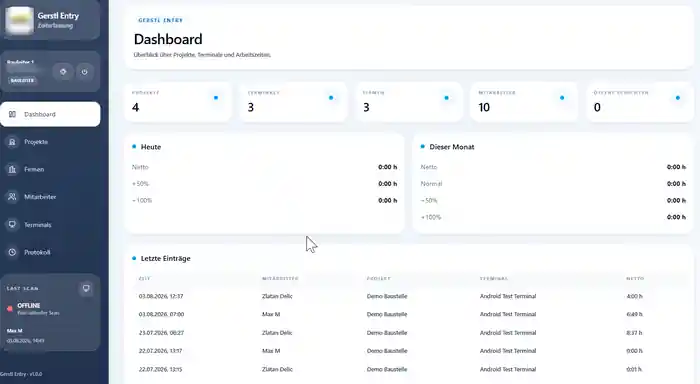

# Zlatan Delić

### Full-Stack Developer · Business Applications · APIs · Workflow Systems

**Full-stack developer building production business software from architecture to deployment.**

I design, develop and maintain complete applications for real operational workflows — including database architecture, backend APIs, React interfaces, mobile and hardware integrations, deployment, debugging and ongoing maintenance.

My main stack is **Laravel / PHP + React / TypeScript**, with additional experience in **Python / FastAPI / Flask**, REST APIs, SQL databases, Linux deployment, Android integrations, NFC and biometric hardware workflows.

**Available for freelance and project-based work:** business applications, API integrations, workflow systems, internal tools, existing-system modernization and full-stack development from concept to production.

---

## What I Bring to a Project

- end-to-end ownership — from requirements and architecture to production
- backend APIs and business logic
- React / TypeScript application interfaces
- database design, migrations and data workflows
- third-party, mobile and hardware integrations
- Linux deployment, debugging and ongoing maintenance
- practical software built around real business processes

---

## What I Build

- full-stack business applications
- Laravel and FastAPI REST backends
- React / TypeScript admin dashboards
- role-based access and permission systems
- workflow and process-management applications
- PDF / CSV reporting and document workflows
- construction and project-management software
- Android terminal integrations
- NFC and fingerprint attendance/access systems
- Linux / Nginx application deployment and maintenance

---

# Featured Projects

## 🏗️ GERSTL Entry

**Workforce Access & Attendance Management System**

**Status:** Production · Active Development · Internal Business System

A complete workforce attendance and access-control platform for construction sites, supporting NFC cards and biometric fingerprint terminals.

**Highlights**
- Laravel REST backend and React administration interface
- project, company and worker management
- role-based permissions
- NFC and fingerprint check-in / check-out
- Android kiosk terminals with offline buffering
- Windows fingerprint enrollment bridge
- working-time and labor-cost calculations
- PDF / CSV reports and audit logging

**Stack:** Laravel · PHP · React · Vite · Tailwind CSS · SQLite · Kotlin / Android · C# / .NET · REST API

[View full case study →](projects/gerstl-entry.md)

---

## 📅 Gerstl-Projekt App

**Construction Process Management & Project Timeline System**

**Status:** Active Development · Internal Business System

A full-stack construction process-management platform for structuring projects, reusable process models, trades, activities, tasks, progress tracking and interactive project timelines.

**Highlights**
- hierarchical project and building structure management
- reusable process models and construction workflows
- centralized trades and activity management
- automatic task generation and task dependencies
- planned vs. actual progress tracking
- interactive timeline / Gantt planning
- project statistics, filters and CSV workflows
- JWT-authenticated REST API and role-based access
- evolved from an earlier Laravel backend to the current FastAPI / Python implementation

**Stack:** FastAPI · Python · SQLAlchemy · Pydantic · React · TypeScript · Tailwind CSS · Axios · SQLite · REST API

[View full case study →](projects/gerstl-management.md)

---

## 🧮 Sanierung-Konfigurator

**Renovation Calculation, Quotation & Planning Platform**

**Status:** Production · In Use · Maintained

A business application for creating structured renovation calculations and professional offers in minutes.

**Highlights**
- calculation engine organized by construction trades
- centralized pricebook
- PDF quotation generation
- signed-document workflow
- project and user management
- granular roles and permissions
- invitation system
- audit log
- construction schedule / planning functionality

**Stack:** Laravel · Sanctum · Spatie Permission · React · TypeScript · Vite · Tailwind CSS · MySQL / MariaDB · DomPDF

[View full case study →](projects/sanierung-konfigurator.md)

---

## 💰 Construction Budget & Cost Controlling

**Budget Planning & Cost Tracking Application**

**Status:** Internal Business Application

A business application for project budget planning, cost controlling and reconciliation of project expenses.

**Highlights**
- project-level budget management
- account and sub-account structures
- planned vs. actual cost workflows
- user roles and project assignments
- document / data processing workflows
- reporting and controlling views

**Stack:** Python · Flask · SQLAlchemy · SQLite · Jinja · PyMuPDF

[View full case study →](projects/budget-app.md)

---

## Technical Toolkit

| Area | Technologies |
|---|---|
| Backend | Laravel, PHP, FastAPI, Flask, Python |
| Frontend | React, TypeScript, JavaScript, Vite, Tailwind CSS |
| APIs | REST API, Laravel Sanctum, JWT authentication, JSON integrations |
| Databases | MySQL, MariaDB, SQLite, PostgreSQL |
| Reporting | DomPDF, PDF generation, CSV export, PyMuPDF |
| Mobile / Hardware | Android, Kotlin, NFC, biometric fingerprint devices |
| Desktop Integration | C# / .NET Framework |
| Deployment | Linux, Ubuntu Server, Nginx, PHP-FPM, Composer, Node.js |
| Development | Git, GitHub, database migrations, role-based authorization |

---

## How I Work

I typically take responsibility for the complete application lifecycle:

**requirements → architecture → database → backend → API → frontend → integrations → deployment → maintenance**

I focus on practical software that improves real business processes rather than isolated demo features.

---

## Source Code & Confidentiality

Several featured projects are real internal business applications. Their production source code, credentials, company data and infrastructure details remain private.

These public case studies describe the architecture, technologies and functionality without exposing confidential data.

---

### Open to freelance and project-based collaboration

I am especially interested in **Laravel / PHP**, **FastAPI / Python**, **React**, **API integrations**, **business applications**, **workflow systems**, and **custom internal software**.
