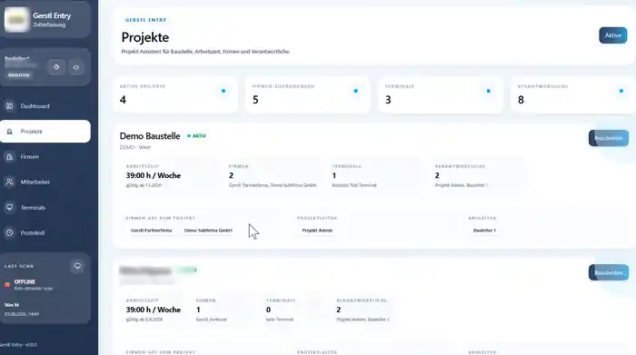
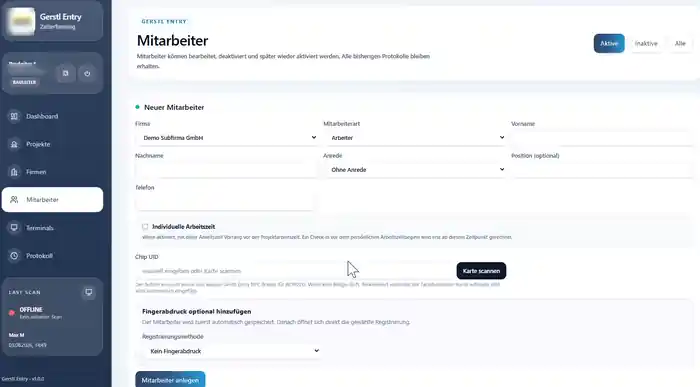
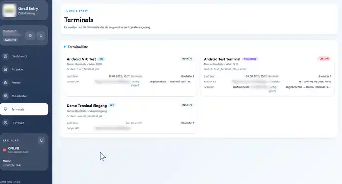
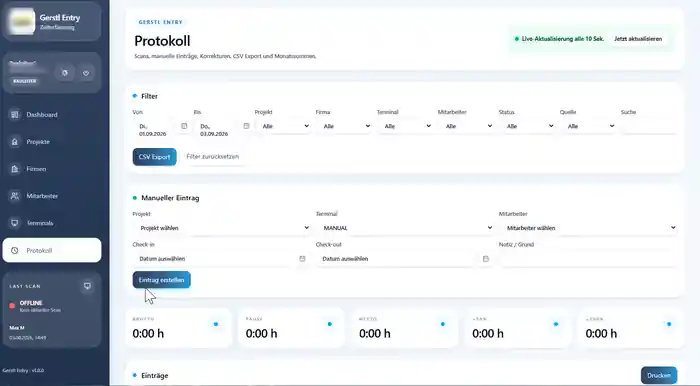

# GERSTL Entry

## Workforce Access & Attendance Management System

GERSTL Entry is a complete internal platform for workforce attendance and access workflows on construction sites.

The system combines a Laravel backend, a React administration interface, Android kiosk terminals, NFC cards, biometric fingerprint hardware and reporting in one integrated application.

---

## Business Problem

Construction sites need a reliable way to record worker arrivals and departures, manage workers and subcontractors, assign people to projects, control permissions and produce usable attendance reports.

GERSTL Entry centralizes these workflows in one system while supporting both NFC and fingerprint-based identification.

---

## What I Built

I designed and implemented the complete solution, including:

- application architecture
- database model and migrations
- Laravel backend
- REST API
- React administration interface
- role-based access control
- Android terminal integration
- NFC workflows
- fingerprint enrollment and identification workflows
- Windows enrollment bridge
- working-time calculation
- labor-cost calculation
- PDF and CSV reporting
- deployment and production maintenance

---

## Core Features

### Projects & Companies
- construction-site project management
- subcontractor / company assignment
- project-specific responsibility structure
- project activation, archiving and reactivation

### Worker Management
- worker profiles
- worker types and status
- hourly-rate handling where permitted
- company assignment
- project assignment
- activation / deactivation without losing historical data

### Attendance
- NFC check-in / check-out
- fingerprint check-in / check-out
- attendance sessions
- gross, break and net working time
- normal hours and overtime categories
- historical wage and labor-cost calculations

### Terminals
- Android kiosk terminals
- project-bound terminal configuration
- device authentication
- NFC and fingerprint terminal modes
- offline buffering and later synchronization

### Fingerprint Integration
- Xperix BioMini Slim 2 hardware
- Windows-based fingerprint enrollment
- Android fingerprint identification
- multiple fingerprint templates per worker
- encrypted biometric-template storage

### Roles & Permissions
- superadmin
- project manager
- site manager
- project-scoped access
- sensitive wage and cost data restricted by role

### Reporting & Audit
- monthly worker reports
- PDF generation
- CSV export
- attendance protocol
- cost overview
- audit trail for critical changes

---

## Architecture

```text
                 ┌────────────────────┐
                 │   React Admin UI   │
                 └─────────┬──────────┘
                           │ REST API
                           ▼
                 ┌────────────────────┐
                 │   Laravel Backend  │
                 └─────────┬──────────┘
                           │
                           ▼
                 ┌────────────────────┐
                 │      Database      │
                 └────────────────────┘

 Android NFC / Fingerprint Terminals
                 │
                 └──────── REST API ─────────► Laravel Backend

 Windows Fingerprint Enrollment
                 │
                 └──────── REST API ─────────► Laravel Backend
```

---

## Technology Stack

- **Backend:** Laravel / PHP
- **Frontend:** React, Vite, Tailwind CSS
- **Database:** SQLite
- **Authentication / Authorization:** role-based application permissions
- **Reporting:** DomPDF, CSV export
- **Android:** Kotlin
- **Windows Integration:** C# / .NET Framework 4.8
- **Fingerprint Hardware:** Xperix BioMini Slim 2
- **NFC Hardware:** ACR122U
- **Deployment:** Ubuntu Server, Nginx, PHP-FPM, Composer, Node.js

---

## Engineering Challenges

The project required more than standard CRUD development. Key challenges included:

- combining web, mobile and hardware components
- keeping attendance workflows reliable when terminals temporarily lose connectivity
- implementing project-scoped authorization
- protecting biometric and sensitive employee data
- handling multiple roles with different financial-data permissions
- maintaining historical attendance and cost data while allowing workers or companies to be deactivated
- integrating a proprietary fingerprint SDK with Android and Windows workflows

---

## My Role

**End-to-end full-stack development and maintenance.**

I was responsible for planning the architecture, implementing the database and API, building the React interface, integrating the Android and Windows components, deployment, debugging and ongoing maintenance.

---

## Screenshots

The screenshots below use demo/anonymized data. Company branding, internal addresses, device identifiers and other infrastructure details have been obscured where appropriate.

### Dashboard


Central overview of projects, terminals, companies, workers, open shifts and recent attendance activity.

### Project Management



Project-oriented administration with working-time models, assigned companies, terminals and responsible project/site managers.

### Worker Management



Worker registration including company assignment, worker type, individual working-time settings, NFC card enrollment and optional fingerprint registration.

### Terminal Management



Management of NFC and fingerprint Android terminals with project assignment, connectivity status and scanner information.

### Attendance Protocol



Attendance protocol with filters, manual entries, live updates, CSV export and calculated working-time categories.

---

> Production source code, credentials, biometric data, company data and infrastructure details are private. This case study documents the technical scope and architecture without exposing confidential information.
