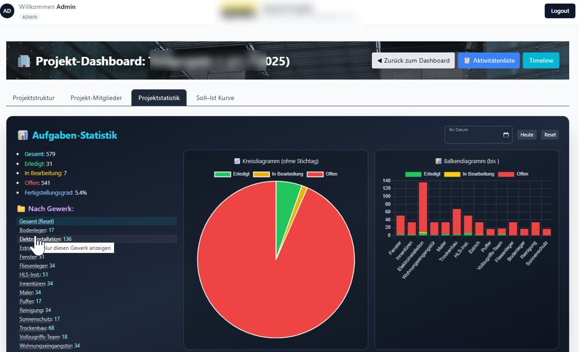
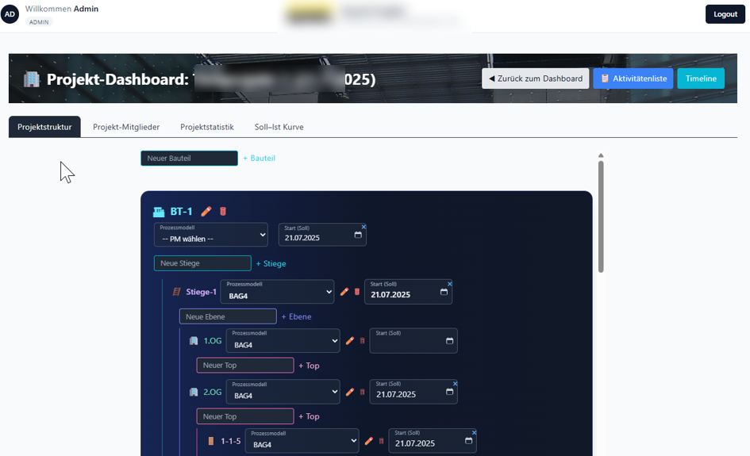
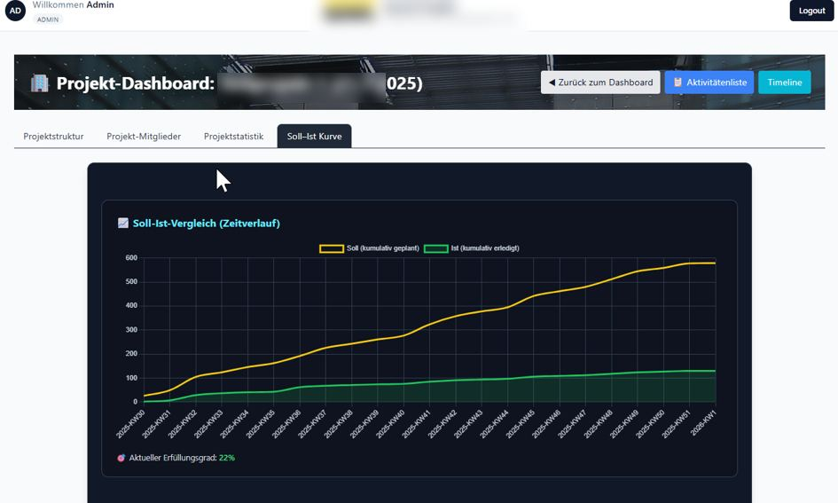
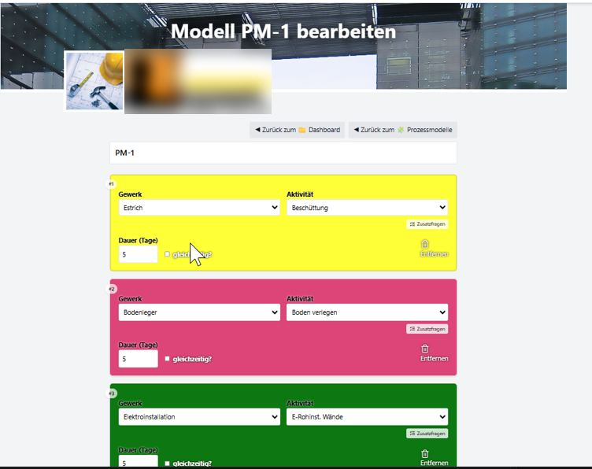
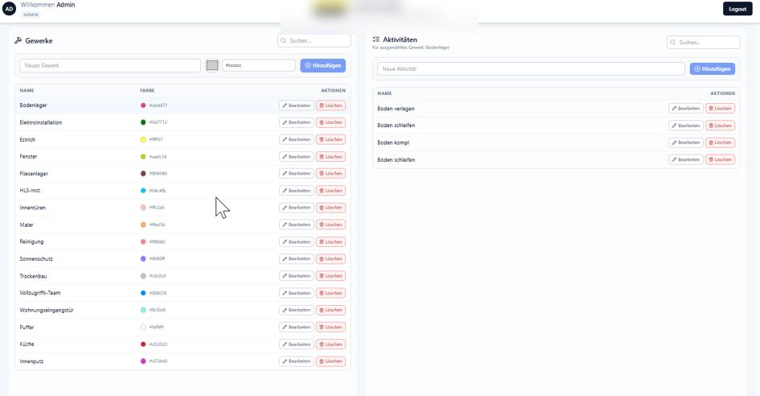
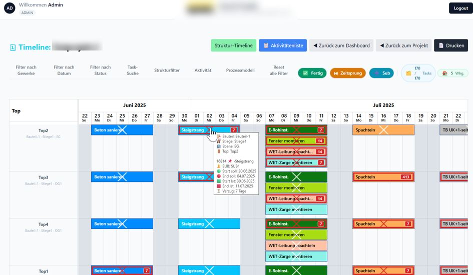
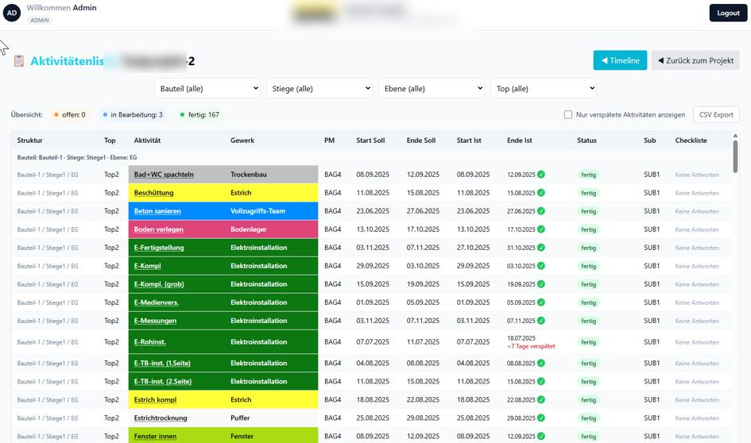

# Construction Process Management CRM

## Project Timeline & Workflow Management System

A full-stack construction process-management application for organizing projects, reusable process models, trades, activities, tasks, dependencies, progress data and interactive construction timelines.

The current implementation uses a **FastAPI / Python backend with a React / TypeScript frontend**. The system evolved from an earlier Laravel-based backend as the architecture and feature set matured.

---

## Business Problem

Construction projects involve many dependent activities that need to be structured consistently across projects while still allowing project-specific planning, progress tracking and schedule control.

The application replaces disconnected spreadsheets and static schedules with reusable process models, hierarchical project structures, automatically generated tasks and an operational project timeline.

---

## What I Built

I implemented and evolved the full-stack application architecture, including:

- FastAPI / Python backend
- authenticated REST API
- SQLAlchemy data layer
- Pydantic-based API schemas and validation
- React / TypeScript frontend
- project and hierarchical structure management
- reusable process models
- trades and activity management
- automatic task generation
- task linking and scheduling workflows
- interactive project timeline / Gantt views
- planned-vs-actual progress tracking
- project statistics and status monitoring
- user authentication and role-based access
- migration of the backend architecture from an earlier Laravel implementation to FastAPI

---

## Core Features

### Project Structure
- project creation and management
- hierarchical building structure
- project-specific process-model assignment
- planned start-date handling
- reusable structures across projects

### Process Models
- reusable construction process templates
- activity assignment by trade
- duration planning
- sequential and parallel activities
- copying and updating process models

### Trades & Activities
- centralized trade management
- color-coded trades
- activity management
- reusable activity definitions
- assignment of activities to process models

### Tasks & Timeline
- project-linked tasks
- generated tasks based on structures and process models
- task dependencies and links
- structure-based timeline view
- status visualization
- planned and actual dates
- delayed-task indicators
- interactive schedule workflows

### Monitoring & Reporting
- task statistics by trade
- completion-status charts
- planned-vs-actual progress curve
- activity overview with filtering
- CSV export workflows

### Authentication & API
- JWT-based authentication
- authenticated REST endpoints
- role-based user access
- FastAPI OpenAPI / Swagger documentation

---

## Architecture

```text
React + TypeScript Frontend
          │
          │ REST / JSON
          ▼
      FastAPI API
          │
          ├── Pydantic Schemas
          ├── Projects / Structures
          ├── Process Models
          ├── Trades / Activities
          ├── Task Generation
          └── Tasks / Timeline
          │
          ▼
      SQLAlchemy ORM
          │
          ▼
     SQLite / SQL DB
```

---

## Technology Stack

- **Backend:** FastAPI / Python
- **ORM:** SQLAlchemy
- **Validation:** Pydantic
- **Frontend:** React, TypeScript, Tailwind CSS
- **HTTP Client:** Axios
- **Authentication:** JWT / bearer tokens
- **Database:** SQLite in local development, SQLAlchemy-based architecture
- **API:** REST / JSON, OpenAPI / Swagger
- **Planning:** interactive timeline and Gantt-style project scheduling
- **Reporting:** charts, filters and CSV workflows

---

## Screenshots

The screenshots below demonstrate the product workflows and user interface developed for the system. The backend architecture later evolved from Laravel to the current FastAPI / Python implementation while preserving and extending the same core business workflows.

### Project Statistics

Project-level monitoring with total task counts, completion status and breakdown by construction trade.



### Project Structure

Hierarchical project setup with building sections, stairs, floors, units and reusable process-model assignments.



### Planned vs. Actual Progress

A cumulative planned-vs-actual progress curve for tracking schedule performance over time.



### Process Model Editor

Reusable construction process templates combine trades, activities, durations and sequencing rules.



### Trades & Activities

Central administration of construction trades and their related activities, including color coding and editing workflows.



### Project Timeline / Gantt

Structure-based project timeline showing scheduled activities, statuses, dependencies and task-level details.



### Activity List

Operational activity overview with structure filters, planned and actual dates, status, sub-assignment and delay indicators.



---

## Engineering Challenges

The central challenge was modeling construction processes so they remain reusable across projects while still producing project-specific tasks, dependencies, schedule data and progress information.

A second major engineering step was evolving the backend from the earlier Laravel implementation to a FastAPI / Python architecture while retaining the established business workflows and frontend concepts. This required rebuilding API endpoints, authentication, ORM models and data flows around FastAPI, SQLAlchemy and Pydantic.

---

## My Role

**Full-stack architecture, implementation and backend modernization.**

I designed the data flows and application model, implemented the project and process-management workflows, built the frontend integration and developed the timeline, reusable process-model and monitoring functionality. I also migrated the backend architecture from the earlier Laravel implementation to the current FastAPI / Python stack.

---

> Production source code and internal company data remain private. The screenshots shown here are portfolio-safe versions prepared to demonstrate the product architecture and functionality without exposing confidential information.
