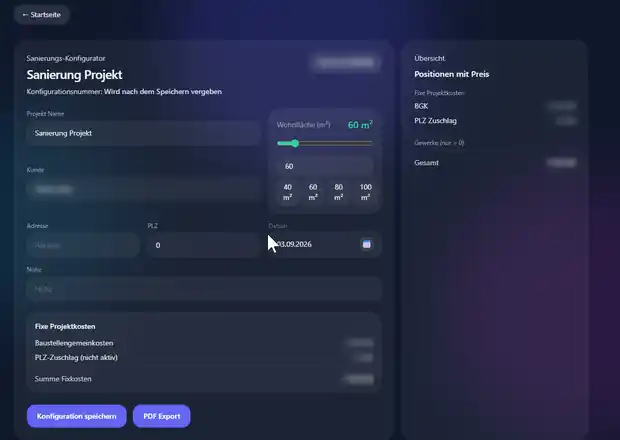
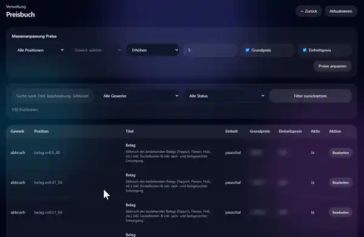
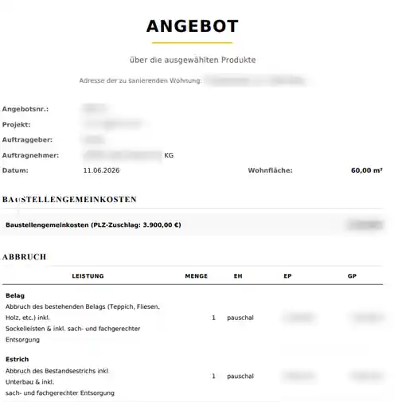
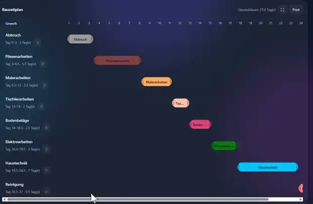

# Sanierung-Konfigurator

## Renovation Calculation, Quotation & Planning Platform

Sanierung-Konfigurator is a full-stack business application for calculating renovation projects, maintaining a centralized pricebook, creating structured offers and supporting project-planning workflows.

---

## Business Problem

Renovation calculations are often time-consuming, inconsistent and dependent on manually maintained spreadsheets or isolated documents.

The application turns that process into a structured digital workflow where project managers can create calculations by trade, apply pricing rules, generate professional documents and manage users and permissions in one system.

---

## What I Built

I developed the application end to end, including:

- application architecture
- Laravel API backend
- React / TypeScript frontend
- database structure and migrations
- authentication and role-based permissions
- project and calculation workflows
- centralized pricebook
- PDF generation
- signed-document handling
- invitation system
- audit logging
- deployment and ongoing maintenance

---

## Core Features

### Renovation Calculations
- calculations organized by construction trades
- configurable pricing logic
- structured work descriptions
- reusable pricebook data
- project-specific calculation data

### Offers & Documents
- offer creation
- PDF generation
- cover sheets
- sub-PDF workflows
- signed-document upload and retrieval

### Pricebook
- centralized item management
- filtering
- editing permissions
- bulk price adjustments

### Users & Permissions
- authentication with Laravel Sanctum
- role and permission management
- invitation system
- user activation / deactivation
- user-specific pricing modifiers

### Project Management
- project creation and maintenance
- project-linked calculations
- construction schedule / planning feature

### Auditability
- audit log for relevant changes
- permission-protected administrative views

---

## Architecture

```text
┌────────────────────────┐
│ React + TypeScript UI  │
└───────────┬────────────┘
            │ REST API
            ▼
┌────────────────────────┐
│     Laravel Backend    │
│ Sanctum + Permissions  │
└───────────┬────────────┘
            │
            ▼
┌────────────────────────┐
│   MySQL / MariaDB      │
└────────────────────────┘

            │
            ├── PDF generation
            ├── signed documents
            └── audit / invitation workflows
```

---

## Technology Stack

- **Frontend:** React, TypeScript, Vite, Tailwind CSS
- **Backend:** Laravel / PHP
- **Authentication:** Laravel Sanctum
- **Authorization:** Spatie Permission
- **Database:** MySQL / MariaDB
- **PDF:** DomPDF
- **API:** REST / JSON
- **Deployment:** shared hosting / Linux-compatible production setup

---

## Engineering Challenges

Key engineering areas included:

- translating complex business-pricing logic into maintainable software
- keeping calculation and pricebook logic consistent across users
- separating permissions for viewing, creating, editing and deleting business objects
- handling professional PDF output from structured application data
- implementing invitation and user-management workflows
- supporting user-specific pricing behavior without duplicating pricebook data

---

## My Role

**Full-stack development, deployment and maintenance.**

I planned the application structure, implemented the backend and REST API, built the React frontend, designed the database, implemented business logic, permissions and PDF workflows, and maintain the production application.

---

## Screenshots

The screens below use demo/anonymized data. Customer information, internal pricing and commercial details have been obscured where appropriate.

### Configuration Dashboard


Overview of renovation configurations and generated offers, with search, project summaries and calculation totals.

### Renovation Calculation



Project setup with living area, base project costs, postal-code surcharge logic and a running calculation summary.

### Trades / Gewerke


Trade-based workflow covering demolition, drywall, screed, tiling, carpentry, flooring, painting, windows, electrical work, building services and specialist restoration work.

### Central Pricebook



Searchable centralized pricebook with trade and status filters, bulk price adjustments and individual item maintenance. Commercial price values are obscured in the public portfolio.

### Generated Offer / PDF



Professional offer PDF generated from structured calculation data. Customer, company and commercial details are anonymized for the public portfolio.

### Construction Schedule



Interactive trade-based construction schedule / Gantt view showing sequencing, durations and the overall renovation timeline.

---

> Production data, customer information, pricing data and private source code remain confidential. This case study focuses on architecture, functionality and engineering scope.
